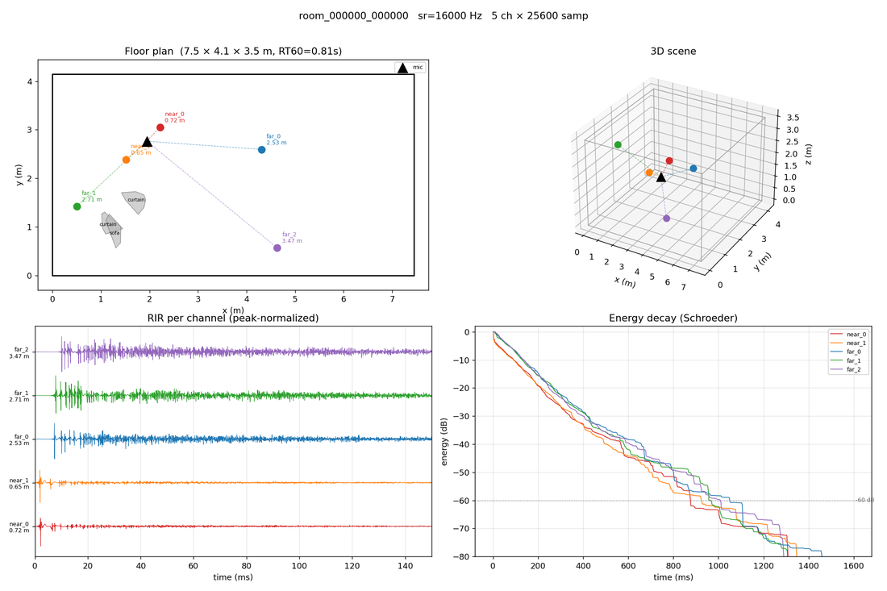
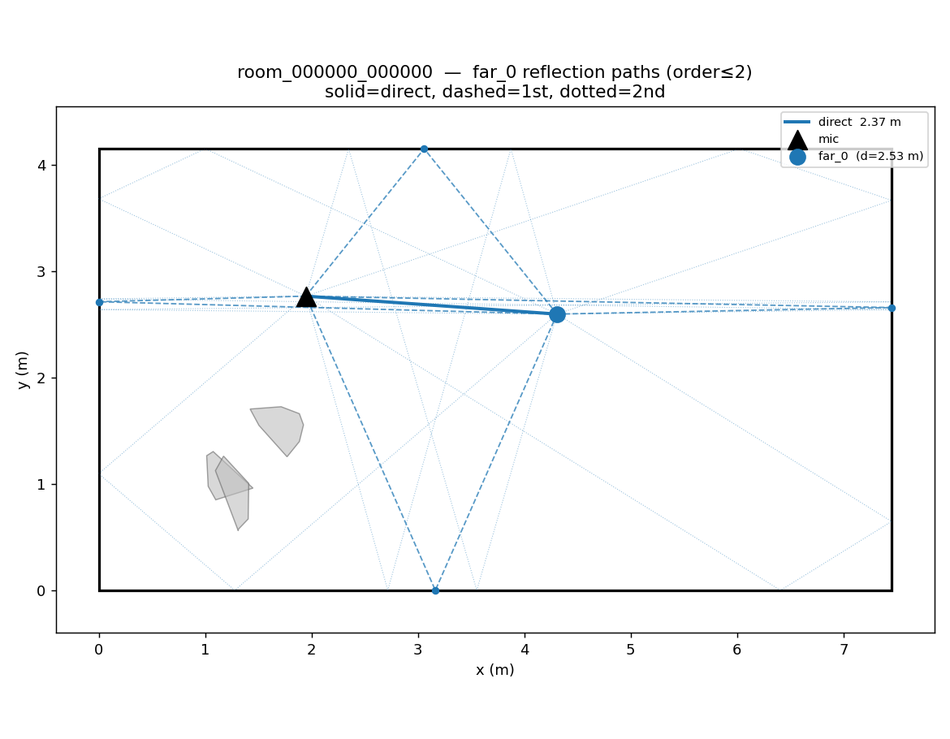
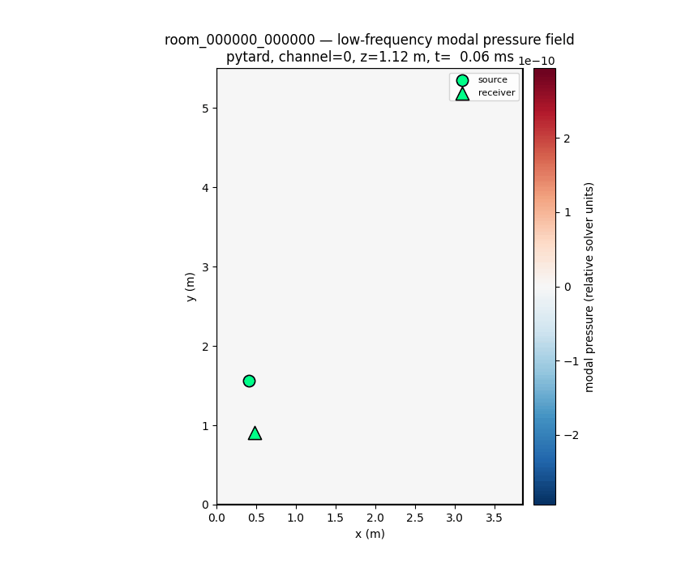

# RIR 生成工具

這個目錄放置近距／遠距語音增強所使用的房間脈衝響應（RIR）工具。
推薦的訓練資料流程是 M6 入口：一個指令串起**確定性生成、逐項 QC 與
release 封裝**。

English version: [`README.md`](README.md)

本 README 只寫**使用方式**。演算法與代碼的對應見
[`docs/audio/rir_realism_algorithm.zh-TW.md`](../../docs/audio/rir_realism_algorithm.zh-TW.md)；
實驗紀錄、審查結論與計畫保留於內部。

> **一律用 `.venv/bin/python`**（或已安裝 `pyroomacoustics`/`rir_generator`
> 且 numpy ABI 相符的環境）。用錯直譯器會產生看起來像程式 bug 的
> collection error 與 validator 失敗。

## 一個 item 是什麼

五聲道 RIR WAV + 同名 JSON sidecar：

| Channel | Source | 預期距離 |
|---:|---|---|
| 0 | `near_0` | 近，通常 `< 1 m` |
| 1 | `near_1` | 近，通常 `< 1 m` |
| 2 | `far_0` | 遠，通常 `> 2 m` |
| 3 | `far_1` | 遠，通常 `> 2 m` |
| 4 | `far_2` | 遠，通常 `> 2 m` |

接收端是一支麥克風；各 channel 是**獨立的 source→mic 傳輸路徑**，不是
同步陣列。JSON sidecar 是資料契約的一部分（channel map、距離、位準
policy、renderer provenance）——WAV 不可與 metadata 分離。M6 的
train/validation/test 以 room 與 acoustic-space disjoint。

## M 字彙

M 是 roadmap 里程碑，不是品質分數：

| 里程碑 | 意義 |
|---|---|
| M0 | 凍結的 RT60 驅動 baseline（`v0`），僅作回歸參考 |
| M1 | 材質先行場景抽樣（`v1`）：相關的房型/裝修/障礙成因 |
| M2 | 複數阻抗/頻變模態損失（實驗性、opt-in） |
| M3 | 同調 PathEvents 高頻帶（opt-in） |
| M4 | PathEvents 早場 + 多帶 FDN 晚場——**M6 預設高頻帶** |
| M5 | 受控實測 campaign 與反演校準（契約已凍結；empirical 證據未結） |
| M6 | 訓練 bank 契約、QC、release、評估、產線決策 |

目前的合成 release 是 **candidate**：產線升級仍卡在真人聽測與下游證據
。

## 生成推薦的 M6 candidate

從 repo 根目錄執行。`--backend path-events-m4` 是預設值（此處顯式寫出
只為清楚）；預設的選型依據是實測衰減形狀（八度衰減比 pyroomacoustics
貼近實測 8 倍—）。

```bash
PYTHONPATH=. .venv/bin/python \
  egs/rir_generation/generate_m6_bank.py \
  --output-dir egs/rir_generation/exp/rir_realism/m6/training_pilot \
  --backend path-events-m4 \
  --n-rooms 1000 \
  --rir-per-room 4 \
  --num-workers 8 \
  --seed 1337 \
  --sample-rate 16000 \
  --duration 1.6 \
  --scene-version v1 \
  --room-type mixed \
  --output-mode calibrated \
  --low-backend pytard-material \
  --record-realized-metrics
```

一個指令跑完 M6.2 生成、M6.3 QC、M6.4 release 封裝：

```text
<output-dir>/
├── path-events-m4_bank/       # WAV/JSON items、manifest、split index、QC
└── path-events-m4_release/    # 已稽核的 training variants 與 recipes
```

中斷可用同參數重跑：resume 逐項比對 task/config/scene/audio 身份
（綁 code revision）。release 目錄永不覆寫——新 bank 用新 `--output-dir`。

### A/B 對照臂

`--backend pyroomacoustics` 在同 seed、同低頻帶下渲染幾何臂。
matched-pilot wrapper 強制這些條件且拒絕覆寫：

```bash
for backend in path-events-m4 pyroomacoustics; do
  PURESOUND_M6_PILOT_ROOMS=100 \
  bash egs/rir_generation/phases/m6_bank/scripts/generate_m6_training_pilot.sh \
    "$backend" <pilot-root>
done
```

### 低頻帶用 GPU

只有低頻解可上 GPU；高頻帶永遠 CPU。每張 GPU 配一個 worker
（每個 CuPy worker 各自持有 CUDA context）：

```bash
uv pip install cupy-cuda12x

PYTHONPATH=. .venv/bin/python egs/rir_generation/generate_m6_bank.py \
  --output-dir <out> \
  --n-rooms 1000 --rir-per-room 4 \
  --num-workers 2 --gpu-devices 0,1 \
  --low-backend pytard-cupy-material \
  --seed 1337 --sample-rate 16000 --duration 1.6 \
  --scene-version v1 --room-type mixed \
  --output-mode calibrated --record-realized-metrics
```

### 小型 smoke run

M6 需要三個 split 皆非空，至少準備幾個房間。僅驗流程，不作訓練設定：

```bash
PYTHONPATH=. .venv/bin/python \
  egs/rir_generation/generate_m6_bank.py \
  --output-dir <out>/smoke \
  --n-rooms 6 --rir-per-room 1 --num-workers 1 --duration 0.4
```

預期：`status=candidate`、QC 6/6、三 split 非空；同參數兩次 fresh run
的 `manifest_sha256` 相同。

## Ingest 實測 RIR（解鎖 `real_native`）

公開實測語料原樣過不了 M6 QC：其時間原點是直達音而非發聲時刻。
ingest 把傳播延遲放回去、拒收找不到直達音的 channel，然後跑與合成
bank 相同的 item QC：

```bash
PYTHONPATH=. .venv/bin/python \
  egs/rir_generation/phases/m6_bank/scripts/ingest_measured_m6_variant.py \
  --source <corpus-view>/items \
  --bank <out>/measured_bank \
  --pruned-bank <out>/measured_pruned \
  --workers 8 --code-revision "$(git rev-parse --short HEAD)" \
  --report <out>/measured_ingest.json
```

`--pruned-bank` 產出 release variant 需要的無隔離副本；未剪枝 bank 留作
「丟了什麼、為什麼」的紀錄。餵給 release builder 讓 real/mixed recipe
變 ready：

```bash
PYTHONPATH=. .venv/bin/python \
  egs/rir_generation/phases/m6_bank/scripts/build_m6_variant_release.py \
  --source-bank <synthetic-qc-bank> --output-dir <out>/release \
  --measured-bank <out>/measured_pruned --qc-workers 8
```

## 產生 M6.6 證據鏈

renderer 核准必須在 QC **之前**蓋章（QC summary 綁 manifest hash），
所以 release 是三趟流程：

```bash
# 1) evaluate：throughput report + 第一趟評估（核准依據）
PYTHONPATH=. .venv/bin/python \
  egs/rir_generation/phases/m6_bank/scripts/build_m6_evidence.py \
  --release <release_1> --evidence-root <ev> \
  --generation-audit <bank>/rir_bank_generation_audit.json --pass evaluate

# 2) approve：剪枝兩個 bank、蓋 renderer 核准、重建 release
PYTHONPATH=. .venv/bin/python \
  egs/rir_generation/phases/m6_bank/scripts/build_m6_evidence.py \
  --release <release_1> --evidence-root <ev> --pass approve \
  --synthetic-bank <bank> --measured-bank <measured_pruned> \
  --rebuild-release <release_2> --approver-id "<誰核准>" --qc-workers 8

# 3) attest：聽測 assignment、簽核、bundle、產線決策
PYTHONPATH=. .venv/bin/python \
  egs/rir_generation/phases/m6_bank/scripts/build_m6_evidence.py \
  --release <release_2> --evidence-root <ev> --pass attest \
  --generation-audit <bank>/rir_bank_generation_audit.json \
  --reviewer-id "<誰簽核>" --participants 24 --report <ev>/summary.json
```

exit 0 = production-ready；exit 3 = 仍 blocked，並逐條印出 13 項檢查。
未給 `--listening-responses` 時聽測報告是 `contract_fixture` 乾跑——
它驗證管線，且**正確地不算** empirical 真人證據。

## 訓練端讀取 release

```yaml
pregenerated:
  used: true
  bank_type: release
  folder: <output-dir>/path-events-m4_release
  recipe_id: synthetic_calibrated   # real_native / mixed_calibrated_real 就緒後可換
  split: train
  usage_role: train
  require_production: false
```

`usage_role` 必須與資料集角色和 split 相符，訓練任務不可能靜默吃到
validation/test 房間。M6.6 憑證未結案前 `require_production: false` 是
刻意的。有 M6 manifest 時，永遠不要把訓練指到未分 split 的 bank 根目錄。

## 檢視與視覺化

| 指令 | 用途 |
|---|---|
| `generate_hybrid_rir.py` | 生成個別 hybrid RIR（低階工具） |
| `generate_m6_bank.py` | 生成、QC、封裝 M6 candidate（推薦入口） |
| `render_spatial_rir.py` | 接收陣列、FOA、可選 BRIR 輸出 |
| `plot_rir.py` | 波形、EDC、鏡像源路徑、低頻壓力場 |
| `inspect_bank.py` | 單一 RIR 資料夾的 metadata 分佈 |
| `compare_bank_acoustics.py` | 跨 bank 的 DRR/C50/衰減/頻譜統計 |
| `compare_modal_acoustics.py` | 低頻模態峰值/間距/Q 統計 |

皆支援 `--help`。低頻壓力場動畫重放單一 item 的模態狀態：

```bash
PYTHONPATH=. .venv/bin/python egs/rir_generation/plot_rir.py low-field \
  --rir <bank>/room_000349/room_000349_000000.wav \
  --backend pytard --channel 0 --t-ms 80 --gif
```

### 同場景 backend 對照

兩欄使用同一個 v1 場景（`scene_sha256` `6bb48bb7…a69d1df`）、同低頻帶、
`16 kHz / 1.6 s` calibrated 輸出；只換高頻 renderer（左：pyroomacoustics，
右：M4）。重生成：

```bash
for backend in pyroomacoustics path-events-m4; do
  PYTHONPATH=. .venv/bin/python egs/rir_generation/generate_hybrid_rir.py \
    --output-dir /tmp/readme_assets/$backend --n-rooms 1 --rir-per-room 1 \
    --sample-rate 16000 --duration 1.6 --scene-version v1 --room-type mixed \
    --output-mode calibrated --low-backend pytard-material \
    --high-backend $backend --seed 1423 --record-realized-metrics
done
```

（seed 1423 讓示意房間落在 bank 的中位殘響，而非長尾。）







### 試聽一個 M4 item

同一句乾聲分別通過同一 item 的近/遠 channel——同一房間內的距離對照。
兩個卷積檔共享一個增益（位準關係保留）；乾聲參考另行縮放，因為
calibrated RIR 的振幅編碼的是參考 SPL 而非聆聽音量。

| 檔案 | 內容 |
|---|---|
| [`m4_sample_dry.wav`](assets/m4_sample_dry.wav) | 乾聲，無房間 |
| [`m4_sample_near_near_0.wav`](assets/m4_sample_near_near_0.wav) | 經 `near_0`（0.45 m） |
| [`m4_sample_far_far_2.wav`](assets/m4_sample_far_far_2.wav) | 經 `far_2`（3.89 m） |
| [`m4_sample_rir.wav`](assets/m4_sample_rir.wav) | 五聲道 RIR 本體 |

```bash
PYTHONPATH=. .venv/bin/python \
  egs/rir_generation/tools/audition/build_readme_sample.py \
  --rir /tmp/readme_assets/path-events-m4/room_000000/room_000000_000000.wav
```

## 目錄佈局

```text
egs/rir_generation/
├── generate_hybrid_rir.py       # 個別 RIR（低階）
├── generate_m6_bank.py          # 公開 M6 一鍵流程
├── render_spatial_rir.py        # 空間/陣列渲染
├── plot_rir.py                  # 圖與壓力場動畫
├── inspect_bank.py              # 資料夾統計
├── compare_*_acoustics.py       # bank 對照
├── assets/                      # 本 README 連結的圖與試聽樣本
├── examples/                    # 可重現 recipe
├── tools/                       # 內部輔助，不是公開介面
│   ├── audition/                # 卷積、預覽 bank、README 樣本
│   ├── bank/                    # 純 symlink 的 bank view
│   └── measured/                # 實測語料掃描與 bank 產出
├── exp/                         # 實驗輸出（不入版控）
└── phases/                      # 各里程碑 validator、config、report
    └── m6_bank/scripts/         # QC、release、ingest、evidence、pilot CLI
```

生成或檢視 RIR 的腳本放這裡；綁單一里程碑的一次性腳本放該 phase 的 `scripts/`，與它寫出的
`reports/` 相鄰；跨 phase 重用但不對外的輔助放 `tools/`；長跑的 bank recipe
放 `examples/`。

## 相依套件

預設 backend（`path-events-m4`）**不需要**第三方 renderer；
`pyroomacoustics` 只有 A/B 對照臂需要；CuPy 為低頻帶 GPU 選配：

```bash
pip install pyroomacoustics   # 只有 A/B 臂需要
uv pip install cupy-cuda12x   # GPU 低頻帶，選配
```

## 延伸閱讀

- [`docs/audio/rir_realism_algorithm.zh-TW.md`](../../docs/audio/rir_realism_algorithm.zh-TW.md) — 演算法 ↔ 代碼對應。
- [`docs/audio/rir_bank_v2.zh-TW.md`](../../docs/audio/rir_bank_v2.zh-TW.md) — M6 契約與證據規則。
- [`docs/audio/rir_bank.md`](../../docs/audio/rir_bank.md) — 訓練端 loader。
